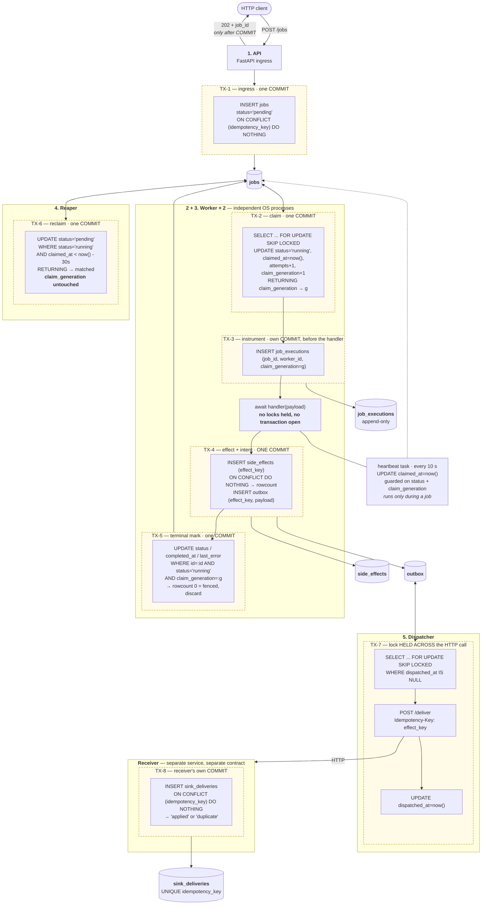
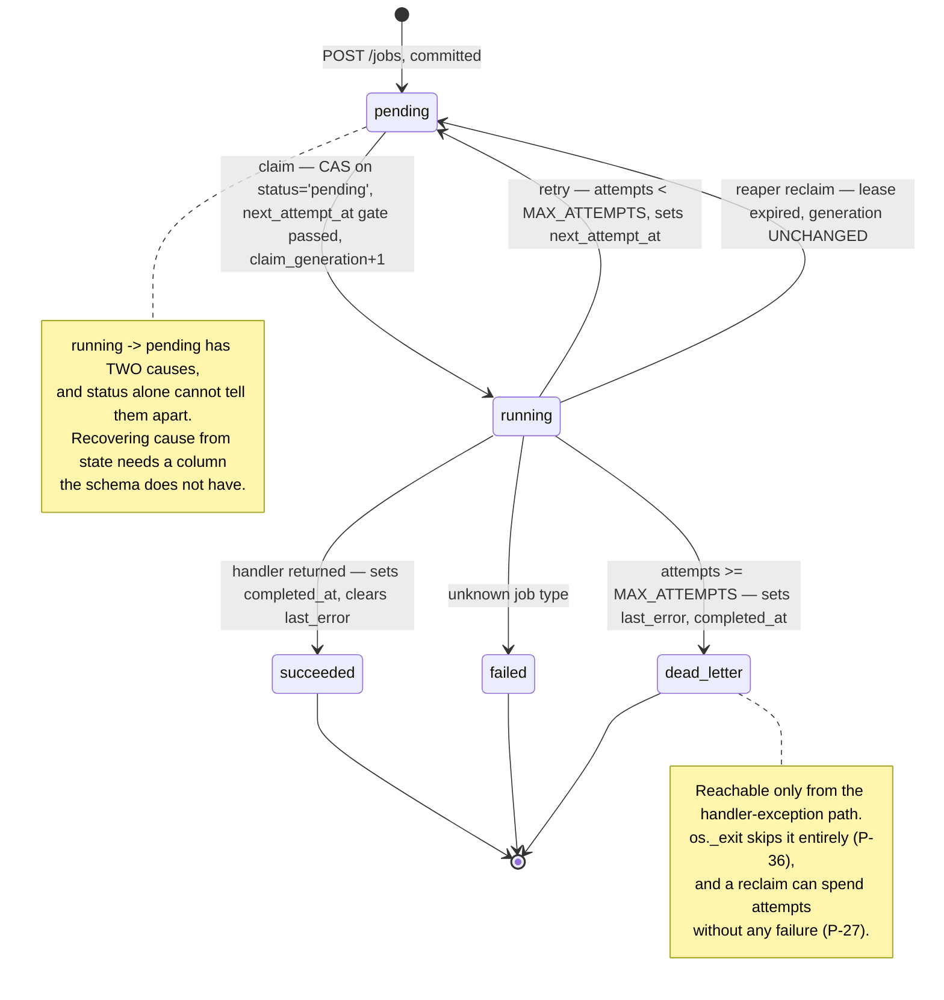

# Relay

**A durable background-job execution engine built on PostgreSQL transactional primitives — and the evidence
trail for every reliability claim it makes.**

[](https://www.python.org/downloads/)
[](https://fastapi.tiangolo.com)
[](https://www.postgresql.org)
[](https://www.sqlalchemy.org)
[](https://alembic.sqlalchemy.org)

> **No Redis. No RabbitMQ. No Celery.** One database, guarded `UPDATE`s, and a verdict on every promise that
> names the failures it was tested against.

---

## The problem this solves, stated as failures rather than features

A job queue is easy to build and hard to *bound*. The interesting question is never *"can it run work in the
background?"* — it is *"when a specific thing breaks, what exactly happens to a job that a caller was already
told would run?"* Relay exists to answer that question for eight named failures, with a measured outcome for
each one and an explicit `[NO EVIDENCE]` where the failure was never produced. The queue itself is deliberately
small: one table for jobs, one append-only instrument, one local effect ledger, one outbox, and a mock receiver
that stands in for the outside world. What the repository actually contains is the
[failure matrix](#failure-matrix) below, [`docs/DECISIONS.md`](docs/DECISIONS.md) — 29 decisions, each with the
cost of the road not taken — and [`docs/PROBLEMS.md`](docs/PROBLEMS.md), 46 failure modes that were reproduced
and measured before they were reasoned about.

The five promises Relay is built to defend, each with the verdict Month 1's evidence actually supports. Three
words are allowed: **`protected`** (holds against the failures tested, and the scope is written next to it),
**`narrowed`** (the window is smaller, not closed), **`[NO EVIDENCE]`** (this was not tested — which is
different from *broken*).

| # | Promise | Verdict | Scope, and what it rests on |
|---|---|---|---|
| 1 | An accepted job is never silently lost | **`narrowed`** | *Accepted* means a `202` was returned, which requires a committed `jobs` row. Requests arriving while Postgres is down are **rejected, not accepted**, and fall outside the promise. A `running` row returns to `pending` on lease expiry within one reaper poll — **while the reaper is alive**, which on the one run that tested it, it was not (`P-43`) |
| 2 | Duplicate execution does not duplicate side effects | **`narrowed`**, at two layers with two different strengths | **Local:** one `side_effects` row per job under `UNIQUE (effect_key)` + `ON CONFLICT DO NOTHING`, across four measured interleavings. **External:** delivery is at-least-once; duplicate *storage* is narrowed by the **receiver's** constraint, in another service. Duplicate execution itself is not prevented and no attempt was made to prevent it |
| 3 | Retries are bounded | **`narrowed`** | `MAX_ATTEMPTS = 3` bounds retry **scheduling**, not dispatches — job `108` sits at `attempts = 4` (`P-27`). A handler that calls `os._exit` skips the bound's branch entirely and never terminates (`P-36`) |
| 4 | Crashes are recoverable | **`narrowed`** at the row level · **`[NO EVIDENCE]`** at the process level | Four interleavings on two real worker processes recovered every row. The **process** does not recover: a database restart killed the worker outright and nothing restarted it (`P-43`). Relay ships no supervisor |
| 5 | Terminal failures enter a DLQ | **`narrowed`** | `dead_letter` is a real status with a stored cause (`last_error`) — 5 rows carry it. It is reachable only through the handler-exception path, so `P-36`'s poison pill and `P-27`'s overdraft both sit outside it |

**No promise is `protected` without qualification, and that is the honest reading rather than a modest one.**
Promise 5 is the strongest and still lives with two named holes.

---

## Table of contents

- [Architecture](#architecture)
- [Failure matrix](#failure-matrix)
- [Measured numbers](#measured-numbers)
- [The claim, in one query](#the-claim-in-one-query)
- [State machine](#state-machine)
- [Schema](#schema)
- [Quickstart](#quickstart)
- [API](#api)
- [Known limits](#known-limits)
- [Repository layout](#repository-layout)
- [How this repo is written](#how-this-repo-is-written)

---

## Architecture

Five processes, five tables, one database. The boxes that matter are the **dashed transaction boundaries** — a
generic queue diagram has arrows between processes, and every question worth asking about Relay is a question
about which writes share a `COMMIT`.



**Four boundary facts the diagram is drawn to make visible.**

**The handler runs in no transaction at all.** TX-2 commits the claim before the handler starts, so arbitrary
user code never holds a row lock. A slow handler cannot leave an `idle in transaction` session pinning locks —
measured as zero such sessions during handler execution.

**TX-4 is one `COMMIT` covering two tables, and that is the entire outbox argument.** The local effect and the
intent to tell the outside world are either both durable or both absent. A crash before that commit leaves
neither, measured four consecutive times in Din 4's crash loop (`side_effects = 0` across four handler runs).
This is what removes the dual write; it does **not** make delivery atomic.

**TX-5 and TX-6 write the same column and never race, because TX-5 carries `claim_generation`.** The reaper
moves `running → pending` and deliberately leaves the generation alone. A worker whose lease was reclaimed
finds `rowcount = 0` and discards its result instead of overwriting a successor's work.

**TX-7 holds a Postgres row lock across an outbound HTTP call, on purpose** (`D-27` Cost 3). That is what makes
a rival dispatcher skip an in-flight delivery and what makes a crash release the lock with no outbox reaper.
The price is a pooled connection sitting in `idle in transaction` for the duration of an external call — a real
cost, written down rather than hidden.

**And the boundary the diagram cannot draw:** nothing in TX-4 can include the receiver. `sink_deliveries` lives
behind an HTTP call in a different service with its own `COMMIT`. Exactly-once at the receiver is Relay's
**requirement on the receiver**, not a guarantee Relay provides.

---

## Failure matrix

The most useful table in this repository. Eight failures; every row carries an evidence cell, and a cell that
would be empty says **`[NO EVIDENCE]`** instead.

**Two columns, two kinds of truth, and conflating them destroys the table's value.** *Recovery mechanism* is a
**claim** — what the design says fixes this — and can be written without ever running the failure. *Evidence*
is an **observation**. A row can have a confident mechanism and no evidence; that is a gap, and it is stated as
one.

| # | Crash point | State immediately after | Recovery mechanism | Evidence |
|---|---|---|---|---|
| 1 | Handler flushed the effect, process dies **before** `COMMIT` | Nothing written. Row still `running`, lease held, `side_effects` and `outbox` both absent. Sequence values consumed | Lease expires → reaper reclaims → next claim re-executes from a clean slate | **`[MEASURED]`** Din 4 Interleaving B′: 4 handler runs, `side_effects = 0`, `2` sequence values burned per iteration, loop period `~32 s` |
| 2 | Effect **committed**, process dies before the terminal mark | `side_effects` + `outbox` durable, `jobs` row still `running`, no terminal status | Reaper reclaims; the re-execution's `INSERT … ON CONFLICT` returns `rowcount = 0` and the job reaches `succeeded` with **one** ledger row | **`[MEASURED]`** Week 3 job `114`: second execution row present, repeated insert `rowcount = 0`, effect count `1`, job `succeeded`. Reviewer rerun additionally measured `side_effects_id_seq` advancing `2 → 3` on the no-op `[MEASURED-R]` |
| 3 | Handler outlives the lease, worker **stays alive** (heartbeat yielding) | `claimed_at` pushed forward by the heartbeat; lease never expires; one execution | Heartbeat, guarded on `status` **and** `claim_generation` | **`[MEASURED]`** Week 3 job `96`: 4 heartbeats, `claimed_at` `40.295 s` past dispatch, one execution row. **Narrows** the duplicate window; see [Known limits](#known-limits) for why it cannot close it |
| 4 | Handler outlives the lease, worker **blocks the event loop** | No heartbeat possible → lease expires → reaper reclaims → a second worker claims and executes the same job concurrently | **Before fencing: nothing.** The stale worker's mark won | **`[MEASURED]`** Week 2 job `95`: `14.783 s` of genuine overlap, both executions legitimate. Din 1 job `126`: stale mark `rowcount = 1` at `08:06:42.342`, `32.973 s` before the live worker finished |
| 5 | Same as 4, **with** the fencing token (stale writer marks after reclaim) | Stale worker's terminal write is rejected; row stays `running` until the next lease cycle | `claim_generation` fence: `WHERE status='running' AND claim_generation=:g` → `rowcount = 0`, result discarded | **`[MEASURED]` — strongest row in this table.** Din 1 job `128`: `held_generation=1 current_generation=2 rowcount=0`. Din 4 job `7`, two real OS processes, disposable DB: `fenced_lines=1`, `conflict_on_mark_lines=0`, grepped by line **name** because two different predicate failures both give `rowcount = 0` |
| 6 | Delivery succeeded, dispatcher dies **before** marking `dispatched_at` | `sink_deliveries` row stored; `outbox.dispatched_at` still `NULL` → the row is redelivered | Receiver's `UNIQUE (idempotency_key)` + `ON CONFLICT DO NOTHING`. **This is the receiver's mechanism, not Relay's** | **`[MEASURED]`** Din 4 Interleaving C, reproduced at review from one `asyncio.gather()`: `1 × 200 applied` + `4 × 200 duplicate` = **`1`** row stored `[MEASURED-R]`. The pre-constraint control measured `N=2 → 2` rows and `N=5 → 5` (`P-33`) |
| 7 | Postgres goes down while the worker is **idle-polling** | In-flight claim `SELECT` raises `InterfaceError`. **The exception escaped `run_worker()` and the process exited** | **None for the process.** The row is durable and the lease expires, so a *future* worker recovers it. Nothing recovers the worker | **`[MEASURED-R]`** Din 5: `26.8 s` outage. `w4d5_step5_worker.stderr.log`'s outermost frame is `worker.py:321 asyncio.run(run_worker())` → `worker.py:185 await session.execute(claim_query)`; stdout stops at `15:22:16.128` and never resumes with `echo=True` on (`P-43`). **The day's log recorded "remained alive" — that was wrong and is corrected here** |
| 8 | Postgres goes down while a job is **mid-handler** | Claim's `attempts` increment already committed; the terminal mark also fails; row stuck `running` | Reaper reclaims on lease expiry; the next claim increments `attempts` **again** — so one outage can cost two attempts, and at `MAX_ATTEMPTS = 3` push a healthy job to `dead_letter` | **`[NO EVIDENCE]`** — during Din 5's outage the worker was idle-polling. Job `2` had finished at `15:22:14.10`; job `1` was pre-seeded `running` and this worker never claimed it; the in-flight statement was a claim `SELECT` that found nothing. **No job was in a handler** |
| 9 | Postgres goes down and **both** worker and reaper die in that outage | Row `running`, `claimed_at` frozen, no Relay process alive | **None.** The lease expires and no one is left to observe it. The reaper **is** the recovery mechanism, and it died too. Relay ships no supervisor — no `restart:` policy, no systemd unit, no orchestrator manifest | **`[NO EVIDENCE]`** — the reaper was **not running** during Din 5's outage. Its first engine line (`select pg_catalog.version()`) is at `15:22:46.428`, after the database returned; it was launched by hand and reclaimed on its first poll `63 ms` later (`P-43`) |

**Row 9's `Recovery mechanism` cell says *"none"*, and writing that is the row's whole deliverable.** An empty
cell tells a reader *"this was not considered"*. `"none"` plus `[NO EVIDENCE]` tells them *"this was
considered, and it is a gap"*. Only the second is worth anything.

**Read rows 5 and 9 together.** The same table holds the best-evidenced claim in the project and an untested
hole, and that contrast is the point of publishing it.

**One number that must not be quoted as recovery latency.** Din 5 reported the reaper reclaiming *"7.9 s after
database start"*. That is **process-launch latency** — the reaper was started after recovery. The honest
statement is a bound, not a number:

```
time from DB recovery to reclaim
    = remaining lease + one reaper poll + possibly one failed poll
    = up to 30 s   +   2.0 s   +   up to 2.0 s
    ... and the whole bound is conditional on the reaper being alive.
```

The lease runs on the **server's wall clock**, not on activity, so a `35 s` outage spends the full `30 s` lease
and the row is reclaimable *immediately* on recovery. The answer is a function of the outage's length. If the
reaper is dead, the bound is **unbounded**.

---

## Measured numbers

Every number carries its source, its `n`, and its condition. Numbers whose artifact did not survive are
labelled — not dropped, and not presented as measured.

### Reproducible from the repository or the evidence database

| Number | What it is | Condition / `n` | Source |
|---|---|---|---|
| **`14.783 s`** | Genuine overlap of two legitimate executions of one job | `45 s` handler under a `30 s` lease; `n = 1`, derived entirely in the database's clock | Week 2 job `95` |
| **`32.973 s`** | Interval during which the API would have reported `succeeded` on work still executing | Pre-fencing, event-loop-blocking handler; `n = 1` | Week 4 Din 1 job `126` |
| **`40.295 s`** | How far a heartbeat pushed `claimed_at` past dispatch without the lease expiring | `45 s` **yielding** handler, 4 heartbeats; `n = 1` | Week 3 job `96` |
| **`rowcount = 0`** | The fence firing on a stale writer's terminal mark | `n = 2` independent runs — single-process (Din 1 job `128`) and two real OS processes on a disposable DB (Din 4 job `7`, `fenced_lines=1`) | Din 1 + Din 4 |
| **`attempts = 4`** vs `MAX_ATTEMPTS = 3` | Retry-budget overdraft: the bound governs scheduling, not dispatches | Job `108`, still readable in the evidence database today | `P-27` |
| **`4` iterations / `~32 s` period / `2` seq values per iteration** | A poison-pill loop that never reaches `dead_letter` | `os._exit(1)` handler, `90 s` window, disposable DB; `attempts` **and** `claim_generation` both reached `4` with `side_effects = 0` | Din 4 Interleaving B′, `P-36` |
| **effect count `1` vs delivery count `5`** | Duplicate delivery does not duplicate storage | `N = 5` concurrent same-key requests from one `asyncio.gather()`: `1 × applied`, `4 × duplicate` | Din 4 Interleaving C (`N=2 → 2` and `N=5 → 5` before the constraint, `P-33`) |
| **`7.01 jobs/s`** drain · **`0.1427 s`** per job | Single-worker throughput | `186` terminal marks in `26.391 s`, first claim `15:11:37.299` → last mark `15:12:03.690`; `0` empty-queue polls during backlog; `186 + 214 = 400` closes. `6.53 jobs/s` including engine handshake | Din 5, recomputed from `w4d5_step4_worker.stdout.log` at review |
| **`19.8 jobs/s`** arrival · **`+12.8 jobs/s`** accumulation | Enqueue rate against drain rate | `400` jobs via `POST /jobs` in `20.16 s` | Din 5 |
| **`p50 = 10.2849 s` · `p99 = 18.3357 s`** | End-to-end latency, `completed_at − created_at` | Measured **under backlog**, so these are dominated by queue dwell, not handler cost | Din 5 |
| **`42.068 s`** | Delay between `CTRL_BREAK_EVENT` and the signal handler running | `time.sleep(45)` is not interruptible by `SIGBREAK` on Windows. So graceful shutdown's bound is the handler's **full** duration, not its remaining duration | Din 2 job `132` |
| **`97`** effective connections | `max_connections = 100` − `superuser_reserved_connections = 3` | Five idle Relay processes hold exactly `5`, one each; `QueuePool` allocates lazily | Din 5 |
| **`113` of `145`** | `job_executions` rows with `claim_generation IS NULL` — the honest pre-instrument era | Evidence database, re-read at Month 1 close | `[MEASURED 2026-09-11]` |
| **`10` vs `7`** | `sink_deliveries_id_seq.last_value` against `count(*)` — three rows deleted by a migration, permanently | The sequence is the witness that survives a `DELETE`. `count(*)` alone reads as *"seven deliveries happened"*; ten did | `P-46` |

### `[REPORTED, NOT VERIFIABLE]` — recorded, mechanism sound, artifact gone

`logs/` is in `.gitignore`, no `w4d5_step2*` or `w4d5_step3*` log survives, and no probe script for either step
exists in the tree (`P-45`). These three cannot be re-derived. Nothing contradicts them; they are not
`[MEASURED]`.

| Number | What it was | Why it is still worth stating |
|---|---|---|
| **`3.0055 s`** | `QueuePool` checkout timeout at `pool_size=2, max_overflow=0` before `sqlalchemy.exc.TimeoutError` | The mechanism is the finding: the failure is **client-side**, and Postgres logged **zero** errors because it never saw the request |
| **`2.8133 s`** vs **`0.4703 s`** | Receiver `POST /deliver` blocked on a held conflicting key, against uncontended | `INSERT … ON CONFLICT DO NOTHING` **waits**; it is not `SKIP LOCKED`. That contrast is derivable from source (`P-41`) |
| **`3.1618 s`** | `/healthz` timing out behind two `/slow-hold` calls in a saturated pool | A liveness probe that fails under load invites a restart, and a restart does not fix load (`P-44`) |

### Two corrections, kept because the direction matters

**Connection headroom is `~3–5`, not `22`.** Din 5's log recorded `97 − 75 = 22`. The `75` omits the load
script's own engine (up to `+15`) and the `psql` / `docker exec` sessions used to watch the run (`+2–4`). A full
count is `~92–94` against `97`. That margin is **narrow** under full theoretical saturation, and full
saturation has not been run.

**The throughput ceiling is handler duration, not SQL echo.** Per-job cost is `0.1427 s`, of which the
handler's own `sleep` is `0.1 s`; `echo=True` accounts for `~11 ms`, about `8%`. Removing `echo` moves `7.01`
to roughly `7.6 jobs/s`. Din 5's design note attributes this the other way round; the arithmetic above is the
source of truth.

**Tests:** `pytest tests -q` → `7 passed`. Those seven cover schema and model invariants; they do **not** drive
the worker loop, the reaper, the dispatcher, or any multi-process interleaving. Every concurrency result in
this README came from running real OS processes against a disposable database and reading their logs, not from
the suite (`P-37`).

---

## The claim, in one query

Two halves doing two different jobs, plus one term added in Week 4. Nothing here is redundant.

```python
select(Job.id, Job.type, Job.payload, Job.attempts)
    .where(
        Job.status == "pending",
        or_(Job.next_attempt_at.is_(None),          # never retried
            Job.next_attempt_at <= func.now()),     # backoff elapsed
    )
    .order_by(Job.created_at, Job.id)
    .limit(1)
    .with_for_update(skip_locked=True)              # half 1: don't queue behind a peer
```

```python
update(Job)
    .where(Job.id == job.id, Job.status == "pending")     # half 2: compare-and-set
    .values(status="running",
            claimed_at=func.now(),
            attempts=Job.attempts + 1,                     # column expression, not read-modify-write
            claim_generation=Job.claim_generation + 1)      # half 3: the fencing token
    .returning(Job.claim_generation)                        # ← the worker's `g` for every later write
```

- **`SKIP LOCKED` removes *waiting*, not duplicates.** Measured: with a `6 s` lock held on the oldest pending
  row, the `skip_locked` worker began real work `1.25 s` in while a plain `FOR UPDATE` worker waited the full
  `6 s`. What prevents a double claim is the row lock plus the compare-and-set — two workers claiming different
  rows `6 ms` apart with no `SKIP LOCKED` produced no duplicate.
- **`rowcount == 0` on half 2 means a peer or the reaper got there first**, so the worker yields rather than
  clobbering state.
- **`attempts=Job.attempts + 1` is a column expression**, so the arithmetic happens inside the `UPDATE`'s row
  lock. A Python read-modify-write here is a textbook lost update.
- **`claim_generation` comes back through `RETURNING`**, so the worker's held generation and the row's committed
  generation originate in one atomic statement and cannot diverge.
- **The `IS NULL` branch is mandatory.** `NULL <= now()` evaluates to `NULL` and `WHERE NULL` excludes the row.
  Without it every pre-existing row becomes permanently unclaimable — silently, with no error.

---

## State machine

Every transition is a guarded `UPDATE`. There is no state machine object; **the guard is the state machine.**



Retry policy, verbatim from `src/worker.py`:

```python
MAX_ATTEMPTS          = 3
BASE_BACKOFF_SECONDS  = 5.0
BACKOFF_MULTIPLIER    = 2.0
BACKOFF_CAP_SECONDS   = 15.0   # first binds at attempt 4 — i.e. above the bound, currently inert
LEASE_DURATION_SECONDS      = 30    # src/reaper.py
HEARTBEAT_INTERVAL_SECONDS  = 10.0
POLL_INTERVAL_SECONDS       = 2.0   # discovery latency on an EMPTY queue, not a throughput divisor

delay  = min(BASE_BACKOFF_SECONDS * BACKOFF_MULTIPLIER ** (attempt - 1), BACKOFF_CAP_SECONDS)
actual = delay / 2.0 + random.uniform(0, delay / 2.0)   # equal jitter
```

**Jitter narrower than the sampling interval is erased before it can be measured.** The worker polls every
`2.0 s`. Four jobs failing together produced an apparent `2.115 s` spread that was actually **two poll ticks**,
with the jobs clustered `33–69 ms` apart inside a tick — *tighter* than the un-jittered round. The convoy the
jitter was added to prevent had re-formed.

---

## Schema

Five tables. Four belong to Relay; the fifth belongs to a different service and is the whole reason promise 2
splits in two.

```sql
CREATE TABLE jobs (
    id                  bigserial   PRIMARY KEY,
    type                text        NOT NULL,
    payload             jsonb       NOT NULL DEFAULT '{}'::jsonb,
    status              text        NOT NULL DEFAULT 'pending',
    attempts            integer     NOT NULL DEFAULT 0,
    created_at          timestamptz NOT NULL DEFAULT now(),
    claimed_at          timestamptz,        -- lease START (an event, not a deadline); NULL = not held
    next_attempt_at     timestamptz,        -- backoff not-before; NULL = claimable now
    idempotency_key     text,               -- enqueue identity   (D-24 layer 1)
    request_fingerprint text,               -- normalised body, sort_keys + compact separators
    claim_generation    bigint      NOT NULL DEFAULT 0,   -- fencing token (D-26)
    completed_at        timestamptz,        -- terminal instant, written under the generation gate
    last_error          text,               -- full traceback; NEVER exposed over HTTP
    CONSTRAINT jobs_status_check
        CHECK (status IN ('pending','running','succeeded','failed','dead_letter'))
);

CREATE TABLE job_executions (               -- append-only instrument, one row per DISPATCH
    id               bigserial   PRIMARY KEY,
    job_id           bigint      NOT NULL,  -- intentionally NO foreign key
    worker_id        text        NOT NULL,
    executed_at      timestamptz NOT NULL DEFAULT now(),
    claim_generation bigint                 -- nullable ON PURPOSE: NULL = predates the instrument
);

CREATE TABLE side_effects (                 -- the local ledger effect itself
    id         bigserial   PRIMARY KEY,
    job_id     bigint      NOT NULL,
    worker_id  text        NOT NULL,
    created_at timestamptz NOT NULL DEFAULT now(),
    effect_key text,                        -- 'job:{id}' — execute identity (D-24 layer 2 / D-25)
    CONSTRAINT uq_side_effects_effect_key UNIQUE (effect_key)
);

CREATE TABLE outbox (                       -- delivery INTENT, committed with the effect
    id            bigserial   PRIMARY KEY,
    job_id        bigint      NOT NULL,
    effect_key    text,                     -- reused as the receiver's idempotency key
    payload       jsonb       NOT NULL,     -- snapshot, decoupled from jobs
    dispatched_at timestamptz,              -- NULL = undelivered. Status AND timestamp in one column
    attempts      integer     NOT NULL DEFAULT 0,   -- counts committed MARKS, not attempts
    created_at    timestamptz NOT NULL DEFAULT now()
);

-- Different service. Different contract. Relay can REQUIRE this; it cannot enforce it.
CREATE TABLE sink_deliveries (
    id              bigserial   PRIMARY KEY,
    idempotency_key text        NOT NULL,
    job_id          bigint      NOT NULL,
    received_at     timestamptz NOT NULL DEFAULT now(),
    body            jsonb       NOT NULL,
    CONSTRAINT uq_sink_deliveries_idempotency_key UNIQUE (idempotency_key)
);
```

**Three deliberate absences.**

**No foreign key and no index on `job_executions`.** It is an observation log, not a relation: it must survive
anything that happens to `jobs`. At `145` rows a `Seq Scan` is correct, and indexing before an
`EXPLAIN ANALYZE` is tuning without a measurement.

**`claim_generation` on `job_executions` is nullable with no default.** A `DEFAULT 0` backfill would make `113`
historical rows claim to belong to generation `0` — a value that means *"first claim under the fence"* on new
rows and *"unknown"* on old ones, with nothing in the schema to separate them. `NULL` says *"predates the
instrument"* in the type system.

**`effect_key` is nullable, and ordinary `UNIQUE` treats `NULL`s as distinct.** `3` of `19` `side_effects` rows
still carry `NULL` and sit outside the constraint's protection. The dispatcher mints a deterministic synthetic
key for those rows because the receiver's column is `NOT NULL`.

**And `status` is `text` + `CHECK`, not an enum.** Postgres enums have no `DROP VALUE`. Adding `dead_letter`
was a `CHECK` swap done as `NOT VALID` + `VALIDATE CONSTRAINT`, which is why it is two migrations rather than
one.

---

## Quickstart

**Requirements:** Python 3.13+, Docker.

> **`requirements.txt` pins nothing.** All eleven dependencies are unconstrained; a resolver run today may not
> reproduce the versions these measurements were taken on. This is a known gap (`P-45`), owned by Month 2.

```bash
git clone <repo-url> relay && cd relay

python -m venv .venv
# Windows:  .venv\Scripts\Activate.ps1
# Unix:     source .venv/bin/activate
pip install -r requirements.txt

cp .env.example .env          # DATABASE_URL points at localhost:5433
docker compose up -d          # PostgreSQL 16 on host port 5433
alembic upgrade head
```

Five processes, five terminals:

```bash
uvicorn src.main:app --reload            # 1. API        → http://127.0.0.1:8000
python -u -m src.worker                  # 2. worker     → claim, execute, mark
python -u -m src.worker                  # 3. worker     → a second one; they compete safely
python -u -m src.reaper                  # 4. reaper     → reclaims expired leases
python -u -m src.dispatcher              # 5. dispatcher → drains the outbox
uvicorn src.sink:app --port 8001         #    receiver   → stands in for the outside world
```

> `-u` is not optional when you care about the output. Without unbuffered stdout, *"the handler never
> finished"* and *"the line was never flushed"* produce identical logs.

**Enqueue and inspect:**

```bash
curl -X POST http://127.0.0.1:8000/jobs \
  -H 'Content-Type: application/json' \
  -d '{"type":"sleep","payload":{}}'
# → 202 {"job_id": 1, "status": "pending"}

curl http://127.0.0.1:8000/jobs/1
```

**Watch the retry policy run.** `boom` fails unconditionally:

```bash
curl -X POST http://127.0.0.1:8000/jobs -H 'Content-Type: application/json' \
     -d '{"type":"boom","payload":{}}'
```

```sql
-- dispatches, growing gaps, and which claim each one belonged to
SELECT job_id, worker_id, claim_generation, executed_at,
       executed_at - lag(executed_at) OVER (PARTITION BY job_id ORDER BY executed_at) AS gap
  FROM job_executions WHERE job_id = <id> ORDER BY executed_at;

SELECT id, status, attempts, claim_generation, last_error FROM jobs WHERE id = <id>;
```

Handlers: `sleep`, `slow`, `boom` (raises immediately). Duration comes from `payload.seconds`; `payload.block`
switches to a blocking `time.sleep` that starves the heartbeat, and `payload.crash_at` triggers `os._exit` at a
named seam. Those three payload keys are how every interleaving in the failure matrix was produced **without
modifying production code**. An unregistered `type` is marked `failed` with **no** execution row — dispatch
never happened.

**The four observability queries** live in `docs/` alongside their Din 5 readings: queue depth, `p50`/`p99`
latency from `completed_at − created_at`, retry rate, and DLQ count. They are SQL a human runs; there is no
`/metrics` endpoint, deliberately (`D-28`).

---

## API

| Method | Path | Response | Notes |
|:---|:---|:---|:---|
| `GET` | `/health` | `200 {"ok": true}` | Liveness. Touches no database — the only probe a saturated pool cannot starve |
| `GET` | `/healthz` | `200` after `SELECT 1` | **Liveness only.** Shares the app pool, so it fails under saturation — see `D-28` Cost 1 |
| `GET` | `/db-ping` | `200 {"db": 1}` | Duplicate of `/healthz`. One of the two should go |
| `GET` | `/slow-hold?seconds=` | `200` | **Load harness left in the production module.** Unauthenticated, no upper bound (`P-44`) |
| `POST` | `/jobs` | `202 {"job_id", "status"}` | Committed before responding. `Idempotency-Key` honoured |
| `GET` | `/jobs/{id}` | `200 {"job_id", "status"}` · `404` | `last_error` is **not** in the response |

`POST /jobs` body: `type` is a non-blank string, 1–100 chars, whitespace-trimmed; `payload` is a JSON object
defaulting to `{}`. Oversized requests are rejected with `413` by a `Content-Length` middleware
(`MAX_REQUEST_BYTES = 266240`).

**`202` is the honest status code, and its semantics define the scope of promise 1.** It promises the job is
durable, not that it succeeded. And a `202` cannot be returned without a committed row — so **a request that
arrives while Postgres is down is rejected, not accepted**. A rejected job is not a lost job. A job that was
accepted and then lost would be, and that is the only case promise 1 covers.

**`202` also cannot promise the caller ever *learns* the `job_id`** — the response can be lost after the
commit. That is what the enqueue-layer `idempotency_key` is for: a retry with the same key returns the original
`job_id` and inserts nothing. Measured: concurrent same-key requests returned job `121` twice while inserting
exactly one row.

---

## Known limits

Stated plainly, because a mitigation described as an elimination is worse than no mitigation.

| Limit | Standing |
|:---|:---|
| **The worker and reaper die on a database restart, and nothing restarts them.** `except Exception` wraps only handler execution; the claim and mark blocks are unguarded, and the reaper's loop has no `try` at all | **`[MEASURED-R]`**, and it lands on the *most likely* code path — an idle worker spends nearly all its time in the unguarded claim poll. This is why promise 4 is `[NO EVIDENCE]` at the process level (`P-43`). Month 2, and the fix is two decisions: where the boundary goes, and whether a crash-loop backoff is needed |
| **Duplicate execution is possible** — a lease can expire under a healthy handler, and the reaper cannot distinguish slow from dead | Reproduced and measured (`14.783 s`). Not mitigated; **absorbed** — the effect is deduped, the execution is not |
| **A heartbeat narrows the duplicate window and cannot close it** | It works because `await asyncio.sleep` yields. A CPU-bound handler, a blocking driver, or a process pause yields nothing and sends nothing — so the heartbeat's coverage is **inversely** correlated with the severity of the failure a lease exists to catch (`P-21`) |
| **Exactly-once delivery is not provided and is not claimed.** Duplicate *storage* at the receiver is narrowed by the receiver's own constraint | Relay can **require** that constraint; it cannot enforce it. A receiver without it breaks promise 2 on the external side without violating a single Relay guard |
| **`result: duplicate` asserts the key was seen, not that the payload matches.** A divergent body under a seen key is discarded and reported as success | **`[MEASURED-R]`** (`P-42`). Discarding is correct for an idempotent receiver; the gap is only empty while keys are minted correctly, and the dispatcher mints **one key per job** — not per delivery, not per effect. That invariant is written nowhere and tested nowhere |
| **The dispatcher has no backoff and no attempt bound.** `outbox.attempts` counts committed marks, not attempts | `P-35`. A permanently failing receiver is retried as fast as the poll allows |
| **`MAX_ATTEMPTS` bounds retry *scheduling*, not dispatches** | Job `108` at `attempts = 4`. A reclaim spends budget with no failure (`P-27`) |
| **A handler that calls `os._exit` never reaches the bound at all** | Measured: `attempts` reached `4`, `status` stayed `running`, `dead_letter` never (`P-36`). Job `136` in the evidence database is one such row, left untouched by design |
| **A database outage mid-handler can cost two attempts and dead-letter a healthy job** | **`[NOT TESTED]`** — enumerated in `D-26` Cost 6. Same root cause as the row above: the bound is evaluated in the handler-exception path |
| **`running → pending` has two causes and the schema records neither** | Retry and reclaim are indistinguishable after the fact. Needs a cause column, not a status value |
| **`/healthz` shares the app's connection pool**, so it fails while the process is healthy and merely busy | A liveness probe that fails under load invites a restart, and a restart does not fix load. Needs a dedicated pool or an aggressive timeout; neither exists (`D-28` Cost 1) |
| **`/slow-hold` is an unauthenticated, unbounded connection hold in the production module** | `P-44`. It is the amplifier for the exact cascade above. It stayed because the measurement required it to share the app's pool |
| **Connection headroom is `~3–5` under full theoretical saturation** | And full saturation has not been run |
| **Shutdown latency is bounded by the handler's full duration** — not its remaining duration | `42.068 s` on a `45 s` blocking handler. If that exceeds the lease, the work completes, the effect commits, the worker exits `rc = 0`, **and the result is never written** (`P-15`) |
| **The payload bound trusts a sender-controlled `Content-Length`** | Known. A read-side byte cap is the real fix |
| **No index on `jobs` beyond the primary key**; the claim query orders by `(created_at, id)` | Deliberate at `n = 133`. Month 2, driven by `EXPLAIN ANALYZE` (`P-03`) |
| **The test suite does not cover concurrency.** `7 passed` covers schema and models | Every concurrency result here came from real processes and their logs (`P-37`) |
| **Three reported numbers have no surviving artifact** | Labelled `[REPORTED, NOT VERIFIABLE]` above (`P-45`). `logs/` is gitignored |
| **A migration ran an unguarded `DELETE` on the evidence database** and destroyed three historical rows | Irreversible, unlogged, and unconditional. `sink_deliveries` went `10 → 7` while the sequence still reads `10`. It deleted the raw evidence for two problem cards (`P-46`) |
| **Single-tenant, no auth, no rate limiting** | Out of scope by design (`D-03`). Do not expose this to a network you do not control |

---

## Repository layout

```text
src/
├── main.py         FastAPI endpoints and app wiring
├── worker.py       claim → instrument → execute → effect+intent → mark; heartbeat, retry, signals
├── reaper.py       lease-expiry reclaim loop, guarded transitions
├── dispatcher.py   outbox drain, FOR UPDATE SKIP LOCKED held across the HTTP call
├── sink.py         mock receiver: UNIQUE + ON CONFLICT DO NOTHING, and a dedup-off switch
├── models.py       SQLAlchemy 2.0 declarative models and named constraints
├── schemas.py      Pydantic v2 request/response contracts
├── database.py     async engine, pool config, application_name attribution, DI dependency
└── middleware.py   ingress payload size bound

alembic/versions/   migration chain
labs/               standalone experiments: pooling, timeouts, signals, lock holds, seeding
tests/              7 schema/model tests — NOT a concurrency suite (P-37)

docs/
├── DECISIONS.md    29 decisions, every one with its Cost and Rejected fields filled
├── PROBLEMS.md     46 reproduced failure modes with the measurements attached
├── POSTMORTEMS.md  others' incidents, and one of my own
├── LEARNING_LOG.md master index into the weekly logs
├── MAP.md          where every claim in this repo is evidenced
├── logs/           what actually happened each day, with honest self-scores
├── daily/          per-day briefs, sealed answer keys, frozen predictions, weekly handoffs
├── planning/       what was intended, written before the week started
└── roadmap/        long-range reference
```

`docs/planning/` states intent; `docs/logs/` states outcome. They are never the same file, so *"did the
original goal get met?"* stays answerable six months later.

---

## How this repo is written

Four rules that shape everything above.

**Every measurement is labelled.** `[MEASURED]`, `[MEASURED-R]` (measured at review), `[INFERRED]`,
`[REPORTED, NOT VERIFIABLE]`, `[NOT TESTED]`, `[NO EVIDENCE]`. *"Not recorded"* is written where a value is
unknown, instead of a plausible number. Wrong predictions stay in the logs, including wrong predictions made
during review — and including one in this README's own history: Din 5's log recorded the worker as *"remained
alive"* through a database restart, and row 7 of the failure matrix corrects it.

**No mitigation is described as an elimination.** `narrows`, not `closes`. `reduces`, not `zero`. The heartbeat
is the canonical example: it works, its coverage is inverse to the severity of the failure it addresses, and
both halves are stated.

**A verification step must be able to fail.** For each check: *what wrong implementation would also pass
this?* An oversized-payload check once returned `413` against a limit that protected nothing, because the body
was already buffered and parsed before the check ran. One request could not tell a working limit from a broken
one; three differential requests could. The same principle found three deleted rows at Month 1 close — a
`count(*)` of `7` reads as *"seven deliveries"*, and the sequence's `last_value = 10` is the arm that
disagrees.

**Every adjective must survive the question *"against which failure?"*** If it cannot, it is deleted. That is
why this file contains a verdict table instead of a summary.

---

## License

MIT. The `LICENSE` file has not been added yet.
